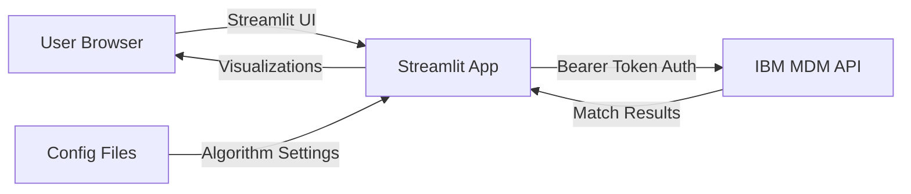
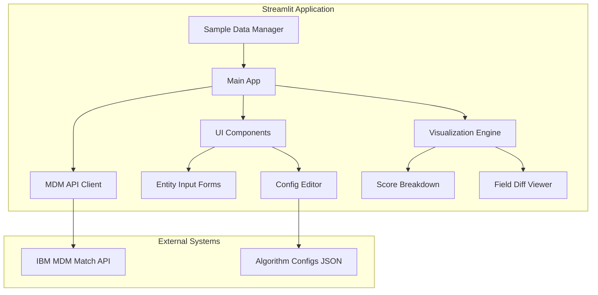
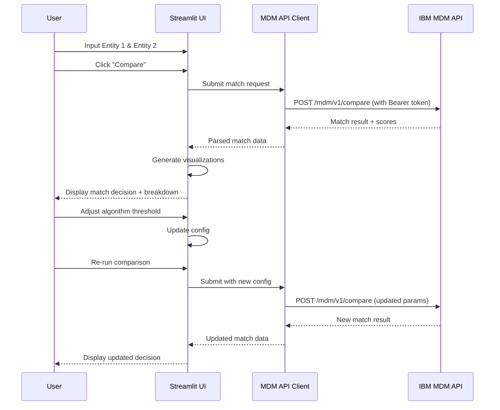

# IBM MDM Match Decision Explorer - Implementation Plan

## Overview

A Streamlit web application that provides an interactive interface for exploring IBM MDM (Match 360) matching algorithms. Users can input two entity records, submit them to the MDM matching API, and visualize the match decision with detailed score breakdowns and field-level contributions.

## Architecture

### High-Level Architecture



### Component Architecture



### Data Flow



## Technical Stack

- **Language**: Python 3.11+
- **Web Framework**: Streamlit 1.30+
- **Key Libraries**:
  - `streamlit` - Web UI framework
  - `requests` - HTTP client for MDM API
  - `pydantic` - Data validation and settings
  - `plotly` - Interactive visualizations
  - `pandas` - Data manipulation
  - `python-dotenv` - Environment variable management
  - `streamlit-aggrid` - Enhanced data grids (optional)

## Project Structure

```
mdm-match-explorer/
├── src/
│   ├── __init__.py
│   ├── app.py                      # Main Streamlit application
│   ├── mdm/
│   │   ├── __init__.py
│   │   ├── client.py               # MDM API client
│   │   ├── models.py               # Data models (Pydantic)
│   │   └── auth.py                 # Authentication handler
│   ├── ui/
│   │   ├── __init__.py
│   │   ├── entity_input.py         # Entity input forms
│   │   ├── config_editor.py        # Algorithm config editor
│   │   ├── visualizations.py       # Match visualizations
│   │   └── sample_data.py          # Sample entity records
│   └── utils/
│       ├── __init__.py
│       ├── config.py               # App configuration
│       └── helpers.py              # Utility functions
├── config/
│   ├── algorithm_config.json       # Default algorithm settings
│   └── sample_entities.json        # Sample entity records
├── tests/
│   ├── __init__.py
│   ├── test_mdm_client.py
│   └── test_visualizations.py
├── .env.example                    # Environment variables template
├── .streamlit/
│   └── config.toml                 # Streamlit configuration
├── requirements.txt                # Python dependencies
├── README.md                       # User documentation
├── IMPLEMENTATION_PLAN.md          # This file
└── run.sh                          # Launch script
```

## Key Features

### 1. Entity Input Interface
- **Dual Entity Forms**: Side-by-side input for two person entities
- **Person Entity Fields**:
  - Legal Name: Given Name, Middle Name, Last Name, Prefix, Suffix, Generation
  - Birth Date
  - Gender
  - Primary Residence: Address Line 1, City, Province/State, Zip/Postal Code, Country, County, Residence Number
  - Contact: Home Telephone, Mobile Telephone, Personal Email
  - Identifications: SSN, Driver's License, Passport
- **JSON Import**: Paste complete entity JSON
- **Sample Data**: Quick-load from predefined examples
- **Validation**: Client-side validation before API submission

### 2. Match Decision Visualization
- **Overall Match Score**: Large, prominent display
- **Match Decision**: Clear indicator (Match / No Match / Possible Match)
- **Confidence Level**: Visual confidence meter
- **Score Breakdown by Rule**: Display matching algorithm results
- **Field-Level Contributions**: Table showing which fields contributed to the score
- **Debug Details**: Show detailed matching information when `details=debug` is used

### 3. Algorithm Configuration Editor
- **Query Parameters**:
  - CRN (Cloud Resource Name)
  - Entity Type (person_entity)
  - Record Numbers (for comparison)
  - Record Type (person)
  - Details Level (debug for detailed output)
- **Live Preview**: See how config changes affect the decision
- **Reset to Default**: Restore original settings

### 4. Visual Field Comparison
- **Side-by-Side Diff**: Highlight differences between entities
- **Color Coding**:
  - Green: Exact match
  - Yellow: Partial/fuzzy match
  - Red: No match
  - Gray: Missing field
- **Similarity Scores**: Per-field similarity percentage
- **Match Method Indicator**: Show which algorithm matched each field

### 5. Sample Data Library
- **Predefined Scenarios**:
  - Exact match (same person, different formatting)
  - Fuzzy match (typos, abbreviations)
  - No match (different people)
  - Edge cases (missing fields, special characters)
- **Quick Load**: One-click to populate forms
- **Custom Samples**: Add your own test cases

## MDM API Integration

### API Endpoint Details

**Base URL**: `https://mdm-api.match-prod-tor-f68b5e114c38aea75a77442f7486d91d-0001.ca-tor.containers.appdomain.cloud`

**Endpoint**: `POST /mdm/v1/compare`

### Authentication
```python
headers = {
    "Authorization": f"Bearer {token}",
    "Accept": "application/json",
    "Content-Type": "application/json"
}
```

### Query Parameters
- `crn` (required): Cloud Resource Name - `crn:v1:bluemix:public:mdm-oc:us-south:a/{account_id}:{instance_id}::`
- `entity_type` (required): Type of entity - `person_entity`
- `record_type` (required): Record type - `person`
- `record_number1` (required): First record identifier
- `record_number2` (required): Second record identifier
- `details` (optional): Detail level - `debug` for detailed matching information

### Request Body Structure

```json
{
  "records": [
    {
      "record_type": "person",
      "attributes": {
        "record_source": "MDM",
        "record_id": "6",
        "record_last_updated": "2017-10-02 18:08:23.638",
        "birth_date": [
          {
            "value": "1961-08-24T00:00:00"
          }
        ],
        "gender": [
          {
            "value": "mALe"
          }
        ],
        "primary_residence": [
          {
            "record_start": "2017-10-02 18:08:23.689",
            "record_last_updated": "2017-10-02 18:08:23.69",
            "residence": "condo",
            "address_line1": "7959 SW King AVE",
            "city": "Toronto",
            "zip_postal_code": "L5D4K8",
            "residence_number": "120",
            "province_state": "ON",
            "county": "Peel",
            "country": "canada"
          }
        ],
        "home_telephone": [
          {
            "record_start": "2017-10-02 18:08:23.793",
            "record_last_updated": "2017-10-02 18:08:23.793",
            "phone_number": "905-722-5903",
            "contact_method": "Telephone Number"
          }
        ],
        "mobile_telephone": [
          {
            "record_start": "2017-10-02 18:08:23.793",
            "record_last_updated": "2017-10-02 18:08:23.793",
            "phone_number": "416-722-5903",
            "contact_method": "Telephone Number"
          }
        ],
        "personal_email": [
          {
            "record_last_updated": "2017-10-02 18:08:23.651",
            "usageValue": "personal_email",
            "email_id": "brownb@us.ibm.com",
            "record_start": "2017-10-02 18:08:23.651",
            "usageType": "6"
          }
        ],
        "social_security_number": [
          {
            "record_last_updated": "2017-10-02 18:08:23.651",
            "usageValue": "social_security_number",
            "identification_number": "982588729873",
            "record_start": "2017-10-02 18:08:23.651",
            "usageType": "6"
          }
        ],
        "drivers_licence": [
          {
            "record_last_updated": "2017-10-02 18:08:23.651",
            "usageValue": "drivers_licence",
            "identification_number": "803356781",
            "record_start": "2017-10-02 18:08:23.651",
            "usageType": "6"
          }
        ],
        "passport": [
          {
            "record_last_updated": "2017-10-02 18:08:23.651",
            "usageValue": "passport",
            "identification_number": "EG346ASS9820M",
            "record_start": "2017-10-02 18:08:23.651",
            "usageType": "6"
          }
        ],
        "legal_name": [
          {
            "record_start": "2017-10-02 18:08:23.641",
            "record_last_updated": "2017-10-02 18:08:23.641",
            "generation": "phd",
            "usage": "Legal",
            "prefix": "rev",
            "given_name": "Bobby",
            "middle_name": "Don",
            "last_name": "Brown",
            "suffix": "2d"
          }
        ]
      }
    },
    {
      "record_type": "person",
      "attributes": {
        "record_source": "MDMx",
        "record_id": "7",
        "record_last_updated": "2017-10-02 18:08:23.638",
        "birth_date": [
          {
            "value": "1961-08-23T00:00:00"
          }
        ],
        "gender": [
          {
            "value": "mALe"
          }
        ],
        "primary_residence": [
          {
            "record_start": "2017-10-02 18:08:23.689",
            "record_last_updated": "2017-10-02 18:08:23.69",
            "residence": "condo",
            "address_line1": "7950 SW King AVE",
            "city": "Toronto",
            "zip_postal_code": "L5D4K8",
            "residence_number": "120",
            "province_state": "ON",
            "county": "Peel",
            "country": "canada"
          }
        ],
        "home_telephone": [
          {
            "record_start": "2017-10-02 18:08:23.793",
            "record_last_updated": "2017-10-02 18:08:23.793",
            "phone_number": "905-722-5903",
            "contact_method": "Telephone Number"
          }
        ],
        "personal_email": [
          {
            "record_last_updated": "2017-10-02 18:08:23.651",
            "usageValue": "personal_email",
            "email_id": "brownb@us.ibm.com",
            "record_start": "2017-10-02 18:08:23.651",
            "usageType": "6"
          }
        ],
        "legal_name": [
          {
            "record_start": "2017-10-02 18:08:23.641",
            "record_last_updated": "2017-10-02 18:08:23.641",
            "generation": "phd",
            "usage": "Legal",
            "prefix": "rev",
            "given_name": "Boby",
            "middle_name": "Don",
            "last_name": "Brown",
            "suffix": "2d"
          }
        ]
      }
    }
  ]
}
```

### Expected Response Structure

The response will contain matching results with scores and detailed comparison information. The exact structure will be determined during implementation based on actual API responses.

## UI Design

### Main Layout

```
┌─────────────────────────────────────────────────────────────┐
│  🔍 IBM MDM Match Decision Explorer                         │
│  ─────────────────────────────────────────────────────────  │
│                                                              │
│  Configuration                                               │
│  ┌──────────────────────────────────────────────────────┐  │
│  │  CRN: [crn:v1:bluemix:public:mdm-oc:us-south:a/...]  │  │
│  │  Record Number 1: [1234567890]                       │  │
│  │  Record Number 2: [1234567899]                       │  │
│  │  Details Level: [debug ▼]                            │  │
│  └──────────────────────────────────────────────────────┘  │
│                                                              │
│  ┌──────────────────────┐  ┌──────────────────────┐        │
│  │   Entity 1           │  │   Entity 2           │        │
│  │   [Load Sample ▼]    │  │   [Load Sample ▼]    │        │
│  │                      │  │                      │        │
│  │  Legal Name          │  │  Legal Name          │        │
│  │  Given:   [Bobby  ]  │  │  Given:   [Boby   ]  │        │
│  │  Middle:  [Don    ]  │  │  Middle:  [Don    ]  │        │
│  │  Last:    [Brown  ]  │  │  Last:    [Brown  ]  │        │
│  │  Prefix:  [rev    ]  │  │  Prefix:  [rev    ]  │        │
│  │  Suffix:  [2d     ]  │  │  Suffix:  [2d     ]  │        │
│  │                      │  │                      │        │
│  │  Birth Date          │  │  Birth Date          │        │
│  │  [1961-08-24]        │  │  [1961-08-23]        │        │
│  │                      │  │                      │        │
│  │  Gender: [Male ▼]    │  │  Gender: [Male ▼]    │        │
│  │                      │  │                      │        │
│  │  Primary Residence   │  │  Primary Residence   │        │
│  │  Address: [7959...]  │  │  Address: [7950...]  │        │
│  │  City:    [Toronto]  │  │  City:    [Toronto]  │        │
│  │  State:   [ON]       │  │  State:   [ON]       │        │
│  │  Zip:     [L5D4K8]   │  │  Zip:     [L5D4K8]   │        │
│  │                      │  │                      │        │
│  │  Contact             │  │  Contact             │        │
│  │  Home:   [905-...]   │  │  Home:   [905-...]   │        │
│  │  Mobile: [416-...]   │  │  Mobile: [        ]  │        │
│  │  Email:  [brownb@]   │  │  Email:  [brownb@]   │        │
│  │                      │  │                      │        │
│  │  Identifications     │  │  Identifications     │        │
│  │  SSN:    [982588]    │  │  SSN:    [        ]  │        │
│  │  License:[803356]    │  │  License:[        ]  │        │
│  │  Passport:[EG346]    │  │  Passport:[        ]  │        │
│  └──────────────────────┘  └──────────────────────┘        │
│                                                              │
│  ┌──────────────────────────────────────────────────────┐  │
│  │              [🔍 Compare Entities]                    │  │
│  └──────────────────────────────────────────────────────┘  │
│                                                              │
│  ┌──────────────────────────────────────────────────────┐  │
│  │  Match Result                                         │  │
│  │  ═══════════════════════════════════════════════════  │  │
│  │                                                        │  │
│  │         ┌─────────────────┐                           │  │
│  │         │   MATCH ✓       │                           │  │
│  │         │   Score: 92%    │                           │  │
│  │         │   Confidence: HIGH                          │  │
│  │         └─────────────────┘                           │  │
│  │                                                        │  │
│  │  Field Comparison:                                    │  │
│  │  ┌────────────────────────────────────────────────┐  │  │
│  │  │ Field         │ Entity 1      │ Entity 2   │ ✓  │  │  │
│  │  │ Given Name    │ Bobby         │ Boby       │ ~  │  │  │
│  │  │ Last Name     │ Brown         │ Brown      │ ✓  │  │  │
│  │  │ Birth Date    │ 1961-08-24    │ 1961-08-23 │ ~  │  │  │
│  │  │ Address       │ 7959 SW King  │ 7950 SW... │ ~  │  │  │
│  │  │ Home Phone    │ 905-722-5903  │ 905-722... │ ✓  │  │  │
│  │  │ Email         │ brownb@...    │ brownb@... │ ✓  │  │  │
│  │  │ SSN           │ 982588729873  │ (missing)  │ ✗  │  │  │
│  │  └────────────────────────────────────────────────┘  │  │
│  │                                                        │  │
│  │  Debug Details (when available):                      │  │
│  │  [Expandable section with detailed matching info]     │  │
│  └──────────────────────────────────────────────────────┘  │
└─────────────────────────────────────────────────────────────┘
```

## Implementation Phases

### Phase 1: Core Setup (Tasks 1-3)
- Set up project structure
- Configure Streamlit app
- Create basic UI layout
- Set up environment and dependencies

### Phase 2: MDM API Integration (Task 4)
- Implement MDM API client with Bearer token auth
- Create data models for requests/responses
- Add error handling and retry logic
- Test API connectivity

### Phase 3: UI Components (Tasks 5-9)
- Build entity input forms
- Implement sample data loader
- Create algorithm config editor
- Build match result visualizations
- Implement field comparison view

### Phase 4: Polish & Testing (Tasks 10-12)
- Add comprehensive error handling
- Implement user feedback mechanisms
- Write documentation
- End-to-end testing
- Performance optimization

## Configuration

### Environment Variables (.env)
```bash
# MDM API Configuration
MDM_API_BASE_URL=https://mdm-api.match-prod-tor-f68b5e114c38aea75a77442f7486d91d-0001.ca-tor.containers.appdomain.cloud
MDM_API_TOKEN=your_bearer_token_here

# MDM Instance Configuration
MDM_CRN=crn:v1:bluemix:public:mdm-oc:us-south:a/122c69f0e8296804c9eebf4dbd4530e4:f4d408e3-25ec-4d48-87fe-ac82018c3b32::
MDM_ENTITY_TYPE=person_entity
MDM_RECORD_TYPE=person

# App Configuration
APP_TITLE="IBM MDM Match Decision Explorer"
APP_ICON=🔍
DEBUG_MODE=false
```

### Streamlit Configuration (.streamlit/config.toml)
```toml
[theme]
primaryColor = "#0f62fe"
backgroundColor = "#ffffff"
secondaryBackgroundColor = "#f4f4f4"
textColor = "#161616"
font = "IBM Plex Sans"

[server]
port = 8501
enableCORS = false
enableXsrfProtection = true
```

## Security Considerations

1. **Token Management**
   - Store Bearer token in environment variables
   - Never commit tokens to version control
   - Implement token expiration handling

2. **Input Validation**
   - Validate all user inputs before API submission
   - Sanitize JSON inputs
   - Prevent injection attacks

3. **API Security**
   - Use HTTPS for all API calls
   - Implement request timeouts
   - Rate limiting awareness
   - Error message sanitization

## Testing Strategy

1. **Unit Tests**
   - MDM API client methods
   - Data model validation
   - Utility functions

2. **Integration Tests**
   - API connectivity
   - Authentication flow
   - Request/response handling

3. **UI Tests**
   - Form validation
   - Sample data loading
   - Visualization rendering

4. **End-to-End Tests**
   - Complete match workflow
   - Config modification workflow
   - Error scenarios

## Success Criteria

- ✅ Successfully authenticate with MDM API using Bearer token
- ✅ Submit entity pairs and receive match results
- ✅ Display match decision with clear visual indicators
- ✅ Show detailed field-by-field comparison
- ✅ Allow configuration of query parameters (CRN, record numbers, details level)
- ✅ Provide sample data for quick testing
- ✅ Handle errors gracefully with user-friendly messages
- ✅ Responsive UI that works on different screen sizes
- ✅ Complete documentation for setup and usage

## Next Steps

1. ✅ **API structure confirmed** - We have the exact curl command and request format
2. **Review and approve** this implementation plan
3. **Switch to Code mode** to begin implementation
4. **Iterate through todo list** systematically
5. **Test with real MDM instance** as we build
6. **Refine based on actual API responses**

## Demo Script (2-Day Presentation)

### Setup (Day 1 Morning - 2 hours)
1. Clone repository and install dependencies (15 min)
2. Configure environment variables with MDM credentials (15 min)
3. Test API connectivity (30 min)
4. Load sample data and verify UI (1 hour)

### Demo Flow (Day 1 Afternoon / Day 2 - 25 minutes)

1. **Introduction** (2 min)
   - Show the problem: Understanding MDM match decisions
   - Introduce the solution: Interactive explorer

2. **Basic Match** (5 min)
   - Load sample entities (Bobby vs Boby)
   - Show match result with score
   - Explain field-by-field comparison

3. **Field Contribution Analysis** (5 min)
   - Deep dive into which fields matched
   - Show exact vs fuzzy matches
   - Highlight missing fields (SSN, mobile, etc.)

4. **Live Comparison** (5 min)
   - Modify entity data (change birth date by 1 day)
   - Re-run comparison
   - Show how score changes

5. **Debug Details** (3 min)
   - Toggle debug mode
   - Show detailed matching algorithm output
   - Explain matching rules applied

6. **Wow Moment** (3 min)
   - Live audience participation
   - Let someone input their own name variations
   - Watch the algorithm decide in real-time

7. **Q&A** (2 min)

**Total: ~25 minutes with buffer for questions**

### Key Talking Points

- **Speed**: "From idea to working demo in 2 days"
- **Transparency**: "See exactly how MDM makes matching decisions"
- **Interactivity**: "Test your own scenarios in real-time"
- **Business Value**: "Tune algorithms with confidence, understand edge cases"